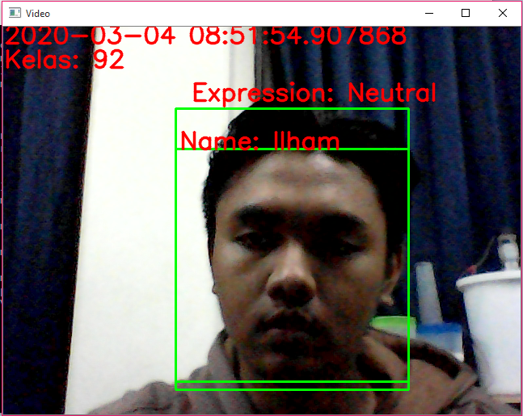
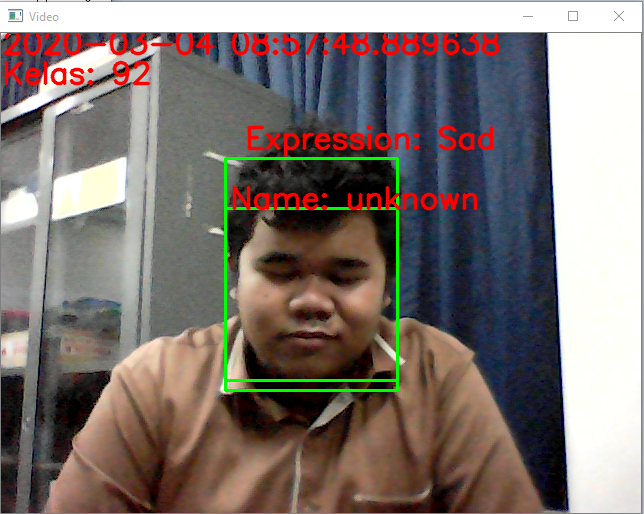

# OpenCV Project: Student Attendance and Facial Expression Detection - My Project LKTIM 2020

## Overview

- This project combines computer vision and deep learning techniques to facilitate student attendance and facial expression detection. Using OpenCV for real-time face detection and TensorFlow/Keras for emotion recognition, the system provides two main functionalities: training a model for facial expression recognition and performing real-time emotion detection via a webcam feed. It is specifically designed to track student attendance based on facial expressions and can operate either by training a recognition model or by displaying live emotion detection results.

- This is my project (LKTIM 2020 --> Lomba Karya Tulis Ilmiah Mahasiswa 2020).
- National Student Scientific Writing Competition.

## Summary:

- This project is designed for student attendance and facial expression detection using OpenCV and TensorFlow. The system can either train a facial expression recognition model or display real-time emotion detection using a webcam feed.

## Directory Structure / Explanation :

Student_Attendance_and_Facial_Expression_Detection_Project/ <br/>
├── data/ # Directory for training and testing data. <br/>
│ ├── test/ # Testing data. <br/>
│ └── train/ # Training data. <br/>
├── dataSet/ # Directory for dataset files. <br/>
├── recognizer/ # Directory for face recognition training_data.yml <br/>
├── trainer/ # Directory for face recognition training_data.yml <br/>
├── dataset.py # Script for managing datasets. <br/>
├── datatrainner.py # Script for training the model. <br/>
├── emotions.py # Script for real-time emotion detection and attendance. <br/>
├── face.csv # Tracks student attendance using facial recognition data and numbered dataset codes. <br/>
├── haarcascade_frontalface_default.xml # Haar Cascade XML file for face detection. <br/>
├── How-to-Run.txt # rovides commands for real-time emotion detection or model training. <br/>
├── model.h5 # file contains the saved weights of the trained facial expression recognition model. <br/>
├── output[i].avi # Contains a video of the live webcam feed with face and emotion annotations. <br/>
├── README.md # Contains purpose, usage instructions, and setup information. <br/>
├── requirements.txt # List of required Python packages. <br/>
└── time.py # Script for time-related functionalities. <br/>

## Dependencies

The project requires the following Python packages. You can install them using `pip`:

## Features

- **Facial Expression Detection**: Uses a convolutional neural network (CNN) to detect and classify facial expressions into seven categories.
- **Student Attendance**: Captures and records student attendance based on facial recognition.
- **Real-time Processing**: Displays live video feed with detected emotions and student names.

<hr/>

## Requirements

- Python 3.x
- Libraries listed in requirements.txt =
  - numpy
  - argparse
  - opencv-python
  - Pillow
  - tensorflow
  - matplotlib
  - imutils

<hr/>

## Installation

1. **Clone the repository:**

   ```bash
   git clone <repository-url>
   cd <repository-directory>
   ```

2. **Install the required packages:**

   Create a `requirements.txt` file with the following content:

   ```
   numpy
   argparse
   opencv-python
   Pillow
   tensorflow
   matplotlib
   imutils
   ```

   Then, install the packages using:

   ```bash
   pip install -r requirements.txt
   ```

<hr/>

## Usage

### Training the Model

To train the facial expression recognition model, use the following command:

```bash
python emotions.py --mode train
```

This will:

- Train the model using images from the data/train and data/test directories.
- Save the trained model weights to model.h5.
- Plot and save the training history as plot.png.

### Display Mode

To start the real-time emotion detection and student attendance system, use:

```bash
python emotions.py --mode display

```

This will:

- Open the webcam and display the live video feed.
- Detect faces and predict emotions from the webcam feed.
- Record attendance in face.csv if the user inputs the correct class when prompted.

<hr/>

## Files

- emotions.py: Main script for training and displaying.
- haarcascade_frontalface_default.xml: Haar cascade for face detection.
- recognizer/training_data.yml: Pre-trained data for face recognition (required for display mode).
- data/train and data/test: Directories containing training and validation images.

<hr/>

## Interfaces:

- Detect expressions of students whose data has been registered: <br/>
  <br/>

- Detect expressions of students whose data has not been registered: <br/>
  <br/>

<hr/>

## Accuracy Testing

- <br/>

## Notes

- Ensure that the haarcascade_frontalface_default.xml file is in the same directory as emotions.py.
- Modify the script emotions.py to match your specific face recognizer setup and class IDs.
- The dataset.py and datatrainner.py scripts should be used as required for dataset preparation and model training, respectively.

<hr/>

## License

This project is licensed under the MIT License - see the LICENSE file for details.

<br/>

#### @Copyright 2020 | Team-LKTI-PSMURO-GUNDAR
